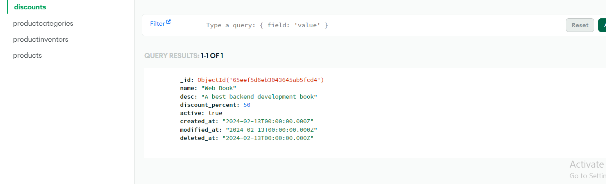

# README

## Answer 1)
### Relationship Between "Product" and "Product_Category" Entities

In the "Product" entity, the "category_id" field likely represents a foreign key that references the primary key of the "Product_Category" entity. This indicates a one-to-many relationship between "Product_Category" and "Product" entities, where one category can have multiple products, but each product belongs to only one category.

So, the relationship between the "Product" and "Product_Category" entities can be summarized as follows:

Each product belongs to one product category.
Each product category can have multiple products associated with it.
## Answer 2)
### Ensuring Valid Category Assignment for Products

To ensure that each product in the "Product" table has a valid category assigned to it, you can enforce referential integrity using foreign key constraints in your database schema. Here's how you can achieve this:

Define Foreign Key Constraint: In the database schema definition for the "Product" table, you would define the "category_id" column as a foreign key that references the primary key of the "Product_Category" table.

Enforce Referential Integrity: By defining the foreign key constraint, the database management system (DBMS) will ensure that each value stored in the "category_id" column of the "Product" table corresponds to a valid primary key value in the "Product_Category" table. This means that you can't insert a product with a "category_id" that doesn't exist in the "Product_Category" table.

## Answer 3)

Product image from mongodb 

productcategory data 

productInventory data

discount data 

Postman api data
